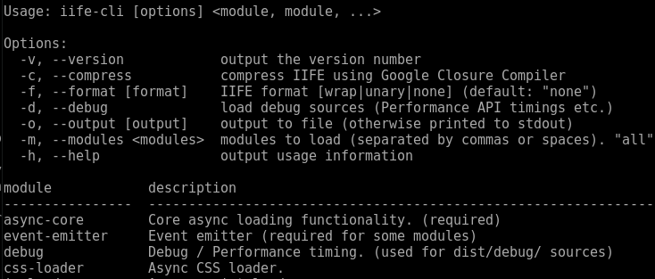

A Node.js IIFE generator for [@style.tools/async](https://github.com/style-tools/async).

The generator is available online on [https://style.tools/iife/](https://style.tools/iife/)

IIFE or [Immediately-invoked Function Expressions](https://medium.com/@vvkchandra/essential-javascript-mastering-immediately-invoked-function-expressions-67791338ddc6) is a coding pattern for loading a script. An IIFE can be used in the browser safely.

#### Example

```html
<script async src="async-iife.js"></script>
```

The IIFE can be optmized using Google Closure Compiler with Advanced Optimizations for optimal compression.

The Node.js module can be executed as a CLI program from the command-line.

# Install

```bash
npm install @style.tools/async-iife
```

# Usage

## CLI

The provided [iife-cli.js](https://github.com/style-tools/async-iife/blob/master/iife-cli.js) script can be used from the command-line. The NPM package contains a `npm run iife` script.

#### Examples

Display usage information and a list with available modules.

```bash
npm run iife -- --help
```



The following command shows how to create an IIFE with `unary` format, output to `path/to/iife.js` and with 3 modules that automatically load the required dependencies.

```bash
npm run iife --  --format unary --compress --output path/to/iife.js --modules css-loader,localstorage,timing
```

Short flags and a space separated module list are supported.

```bash
npm run iife --  -f unary -c -o path/to/iife.js -m "css-loader localstorage timing"
```

When omitting the `--output` flag the script is printed to the console, e.g. for `> output.js`.

## Node.js module

```javascript
// load Node.js module
const iife = require('@style.tools/async-iife');

// return script text for inlining
// uses memory-cache @link https://www.npmjs.com/package/memory-cache
iife.generate(['css-loader', 'timing'], {
   debug: true, // debug sources
   format: 'unary' // !function(){ ... }()
}).then(function(iife_script) {
	
   // iife_script contains the IIFE script text

});

// output to file
iife.generate(['css-loader', 'timing'], {
   compress: true, // Google Closure Compiler API compression
   format: 'wrap', // (function(){ ... })()
   output: 'path/to/iife.js',
   output_stats: true // return { modules:[], size:0, gzip_size:0 }
}).then(function(stats) {
	
   // iife.js written
   console.log(stats);

});
```

 The Node.js module can be used efficiently within a Node.js CMS. IIFE's are cached in memory using [memory-cache](https://github.com/ptarjan/node-cache). 

 Warning: the generator depends on the free [Google Closure Compiler API](https://developers.google.com/closure/compiler/docs/api-ref) that may not be 100% reliable. When using the generator in production it may be an option to use a local Google Closure Compiler service.
