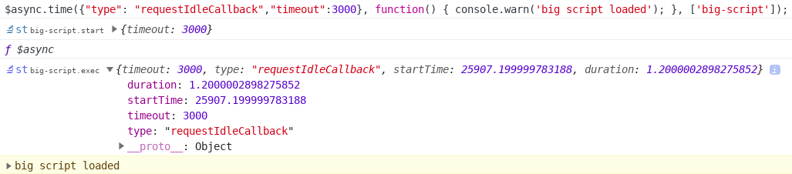

# Usage

The Async Loader can be configured using JSON that is structured via [JSON schema](https://github.com/style-tools/async/tree/master/json-schemas).

```javascript
$async(
   [/*stylesheets*/],     // string, object or an array of strings or objects
   {/*options*/},         // object
   [/*capture*/],         // string, object or an array of strings or objects 
   {/*capture options*/}  // object
).then(function() { /* ready */ });

// alternative load method for chaining when using the API module
$async.load(/*...*/).load(/*...*/).then(/*...*/)

// custom timing when using the API module
$async.time(
  {/*timing config*/},
  function() {
    // script
  },
  [/*optional debug-info*/]
);
```

# Examples

## Simple async loading

```javascript
// simple async loading
$async('sheet.css').then(function() { /* onload */ });
```

## Timed and dependency based loading

The following complex example displays the use of dependency configuration, download and render timing, URL re-basing (compression), `localStorage` cache with `Cache-API` fallback for big stylesheets, HTTP `HEAD` based background cache update, CORS proxy for caching of external stylesheets, XHR configuration and the ability to define a DOM insert target (after or before a DOM element).

```javascript
// dependencies, timing and global options
$async(
   [  // load 3 stylesheets
      'sheet.css', 
      {
         href:'other-sheet.css',
         dependencies: ['sheet.css'], // wait for sheet.css via dependencies and insert after DOM element
         load_timing: {
            type: 'inview',
            selector: '#footer', // download stylesheet when footer becomes visible within 250 pixels
            offset: -250
         }
      }, 
      {
         href:'mobile-sheet.css',
         target: {
            after: 'meta[charset]'
         },
         load_timing: {
            type: 'media', // download stylesheet based on a media query (also works with viewport changes)
            media: 'screen and (max-width: 600px)'
         }
      }
   ],
   {  // global options applied to all stylesheets
      base: '/long/path/to/css/', // base directory for relative sheet URLs
      cache: {
         type: "localStorage",
         max_size: 10000, // cache only <10kb
         fallback: 'cache-api', // fallback to Cache-API for bigger sheets
         update: {
            head: true, // use HTTP HEAD request to check for 304 - Not Modified
            interval: 86400 // update once per day
         },
         source: ['cssText','xhr','cors'], // default
         cors: {
            proxy: 'https://cors-anywhere.herokuapp.com/', // more proxies on https://gist.github.com/jimmywarting/ac1be6ea0297c16c477e17f8fbe51347
         },
         xhr: {
            headers: {
               "x-special-header": "secret-key" // request header to include in XHR requests
            }
         }
      },
      attributes: { 
         "data-app-sheet": "1" // HTML attribute to add to stylesheet element
      },
      render_timing: 'requestAnimationFrame' // render via requestAnimationFrame
   } 
).then(function() { /* ready */ });
```

## Chainable and events

The Async Loader is chainable and provides the option to subscribe to events via the `.on`, `.once` and `off` methods.

```javascript
// chainable
$async
   .on('load',function(sheet, sheetEl){
      //  sheet.css or other-sheet.css loaded
   }) 
   .on('sheet-ref',function() { }) // sheet with ref-name loaded
   .on('sheet.css', function() {}); // sheet with href loaded
   .load({
      href: 'sheet.css', 
      ref: 'sheet-ref'
   })
   .then(function() { }) // sheet.css loaded
   .load('other-sheet.css');
```

# Configuration

The configuration of the CSS loader is available in JSON schemas.

https://github.com/style-tools/async/tree/master/json-schemas/

## Load configuration

`$async()` accepts a single string (URL), a configuration object or an array of strings and/or objects.

The stylesheet load configuration object contains the following parameters:

| Option                        | Description     | Type     |
|--------------------------------|-----------------|-----------------|
| `href`                | The stylesheet URL. | `String`    |
| `ref`                 | A reference to use for dependency or onload events. | `String`    |
| `media`                 | A `media` attribute to define on the stylesheet HTML element. | `String`    |
| `attributes`                 | An object of HTML attributes to define on the stylesheet HTML element. | `Object`    |
| `base`                 | A base URL for relative URL re-basing. | `String`  |
| `target`                | A query selector to insert the stylesheet before, or an object. | `false`, `String` or `Object`  |
| `target.after`                 | A query selector for an DOM element to insert the stylesheet after. | `String`  |
| `target.before`                 | A query selector for an DOM element to insert the stylesheet after. | `String`  |
| `load_timing`                 | Download timing configuration (see [timing](#) module). | `String` or `Object`  |
| `load_timing.type`                 | Timing method type (`domReady`, `setTimeout`, `requestAnimationFrame`, `requestIdleCallback`, `inview`, `media`, `method`) | `String`  |
| `load_timing.frame`                 | Frame target for method `requestAnimationFrame` | `Number`  |
| `load_timing.timeout`                 | Timeout in seconds for methods `requestIdleCallback` and `requestAnimationFrame` | `Number`  |
| `load_timing.media`                 | Media Query for method `media` (responsive) | `String`  |
| `load_timing.selector`                 | Query selector for method `inview` | `String`  |
| `load_timing.offset`                 | Offset for method `inview`, see [in-view](https://github.com/camwiegert/in-view#api) | `Number` or `Object`  |
| `load_timing.offset.top`                 | Offset from top | `Number`  |
| `load_timing.offset.right`                 | Offset from right | `Number`  |
| `load_timing.offset.bottom`                 | Offset from bottom | `Number`  |
| `load_timing.offset.left`                 | Offset from left | `Number`  |
| `load_timing.threshold`                 | Ratio of an elements height and width that needs to be visible for method `inview` | `Number`  |
| `load_timing.method`                 | Method name to define on `window` to trigger the callback. | `String`  |
| `render_timing`                 | CSS render timing configuration (see [timing](#) module). | `String` or `Object`  |
| `render_timing.*`                 | See `load_timing.*` | `Object` |
| `exec_timing`                 | Script exec timing configuration (see [timing](#) module). | `String` or `Object`  |
| `exec_timing.*`                 | See `load_timing.*` | `Object` |
| `cache`                 | A string or object with cache configuration (see [cache](#) module). | `String` or `Object`  |
| `cache.type`                 | Cache method, `localstorage` or `cache-api`. | `String`  |
| `cache.namespace`                 | Namespace for cache. | `String`  |
| `cache.expire`                 | Expire time in seconds. | `Number`  |
| `cache.max_size`                 | Maximum size in bytes to store in cache. | `Number`  |
| `cache.source`                 | Methods for CSS source retrieval, `cssText`, `xhr` or `cors` | `String` or `Array`  |
| `cache.xhr`                 | An object with XHR request configuration. | `Object`    |
| `cache.xhr.headers`                 | An key/value object with HTTP headers to include in the XHR request. | `Object`    |
| `cache.cors`                 | An string with a CORS proxy URL or a object with CORS proxy configuration. | `String` or `Object`    |
| `cache.cors.proxy`                 | A proxy URL. | `String`  |
| `cache.cors.xhr`                 | The same as `cache.xhr` (override for proxy). | `Object`  |
| `cache.update`                 | Background update configuration object. | `Object`  |
| `cache.update.interval`                 | Background update interval in seconds. | `Number`  |
| `cache.update.head`                 | Enable/disable HTTP `HEAD` `304 - Not Modified` check based update. | `Boolean`  |
| `cache.fallback`                 | The same options as `cache` to use as fallback. | `String` or `Object`  |
| `dependencies`                 | A string, object or array of strings and/or objects. | `String` or `Object`  |
| `dependencies.match`                 | Dependency match pattern. | `String`  |
| `dependencies.regex`                 | Boolean to enable/disable regular expression based match. | `Boolean`  |

### Example JSON

```json
{
  "href": "sheet.css",
  "dependencies": [
    "other-sheet.css"
  ],
  "cache": {
    "type": "localstorage",
    "max_size": 10000,
    "fallback": "cache-api",
    "update": {
      "head": true,
      "interval": 86400
    },
    "source": "cors",
    "cors": {
      "proxy": "https://cors-anywhere.herokuapp.com/"
    },
    "xhr": {
      "headers": {
        "x-special-header": "secret-key"
      }
    }
  },
  "attributes": {
    "data-app-sheet": "1"
  },
  "load_timing": {
    "type": "inview",
    "selector": "#footer",
    "offset": -250
  },
  "render_timing": "requestAnimationFrame"
}
```

### Example just-in-time loading

`$async` enables `just-in-time` loading of CSS and javascript which can provide a great performance win for many websites. The following example preloads a popup script on `domReady` and executes it when the script is needed, saving CPU time for most visitors.

```javascript
// preload popup script in background
$async.js({
    "ref": "popup",
    "dependencies": "jquery",
    "load_timing": "domReady",
    "exec_timing": {
        "type": "method",
        "method": "exec_popup_script"
    }
});

// just-in-time
jQuery('button.popup').on('click', function() {

    // code after popup script is loaded
    $async.on('popup', function() {
        alert('popup script ready');
    });
    
    // load popup script
    exec_popup_script();
});
```

## Global configuration

Most of the options from the load configuration can be defined in the global configuration to apply to all stylesheets.

The following options can be defined via the global options.

| Option               |
|----------------------|
| `media`              |
| `attributes`         | 
| `base`               |
| `target`             |
| `load_timing`        |
| `render_timing`      |
| `cache`              |


```javascript
$async(
  ["sheet1.css", {"href":"sheet2.css", "ref": "test"}], 
  // global options applied to sheet1.css and sheet2.css
  // ref from sheet2.css overrides the global ref
  {
    "ref": "global-options",
    "load_timing": "domReady"
});
```

## Custom timing

`$async.time` enables to make use of the timing module for any purpose, for example for script startup-time optimization or to execute a script when an element scrolls into view.

`$async.time` requires both the API and timing module.

```javascript
$async.time(
  {
     "type": "requestIdleCallback",
     "timeout": 3000
  },
  function() {
    // big script
  },
  ["big-script"]
);
```

With JSON compression it would reuslt in the following config for `requestIdleCallback` with a `3000ms` timeout.

```json
{"2":53,"57":3000}
```

When using debug sources, the browser console will provide Performance API details.


