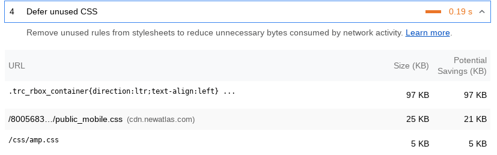

# Introduction

The unused CSS remover is part of the 📐 Style.Tools browser widget (see [introduction](../README.md)).

The unused CSS remover is a [PostCSS](https://github.com/postcss/postcss) (CSS parser) based solution that enables to remove CSS code that is not used on a page. The removal of unused CSS is essential for achieving perfect performance scores.

The 📐 Style.Tools unused CSS remover is designed to achieve the absolute best size reduction while being effective at preventing the removal of essential CSS code.

The unused CSS remover enables to remove Critical CSS code from stylesheets and to perform UI actions to discover essential CSS code on a page based on the UI state such as the viewport size, scroll position, events and more.

