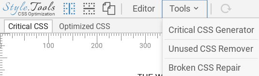
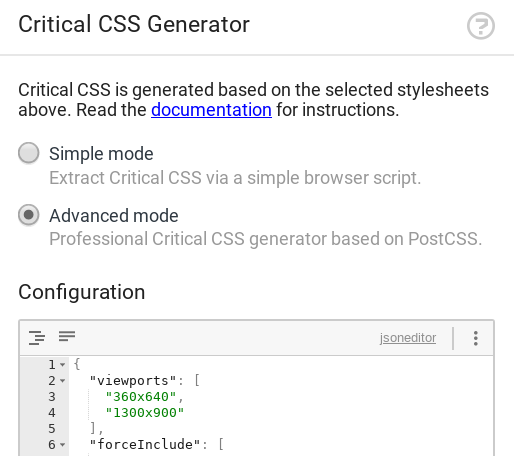
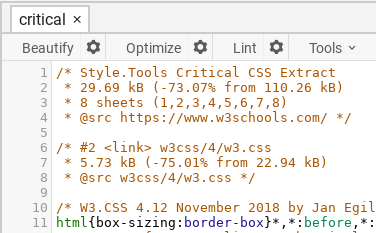
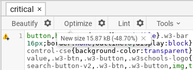
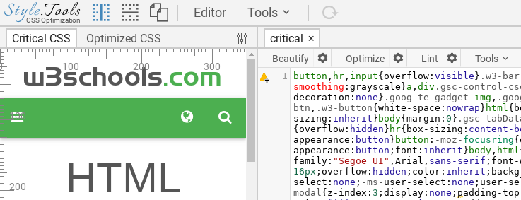

# Advanced

The advanced Critical CSS generator is based on [PostCSS](https://github.com/postcss/postcss). Some of the unique features are the support for multiple viewports (responsive designs) and async script-injected stylesheets.

The advanced generator can produce pixel-perfect responsive Critical CSS with a single click when configured correctly. By using UI actions the generator is able to discover all essential above-the-fold CSS automatically, including for example the purely essential CSS required for a CSS-only mobile menu.

The output of the advanced Critical CSS generator is **pure and unfiltered**. The generator does not apply compression or optimization techniques. The output is thereby reliable. No CSS code goes missing without the control of the designer.

Professional CSS code optimization software such as [clean-css](https://github.com/jakubpawlowicz/clean-css) are able to provide code optimization and compression. The final result is thereby better (better compression and more accurate) than from other tools.

The creation of Critical CSS using the advanced generator consists of three steps:

1. Generating Critical CSS using the generator
2. Optimizing and compressing the result
3. Tuning the Critical CSS (Above the fold optimization)

# Usage

The advanced Critical CSS generator provides many options for tuning the generator and PostCSS parser. The configuration of the Critical CSS generator is available in a JSON schema.

https://style.tools/json-schemas/critical-css-generator.json

## Options

| Option                         | Description     | Type     |
|--------------------------------|-----------------|----------|
| `atRulesToKeep`     | An array of CSS `@` rules (string or regular expression) to forcefully include in the Critical CSS. | `["media", "charset", "/rule(.*)/i"]` |
| `atRulesToRemove`    | An array of CSS `@` rules (string or regular expression) to forcefully remove from the Critical CSS. | `["media", "charset", "/rule(.*)/i"]`   |
| `selectorsToKeep`      | An array of CSS selectors (string or regular expression) to forcefully include in the Critical CSS. | `[".selector", "/\\.selector(.*)/i"]` |
| `selectorsToRemove`      | An array of CSS selectors (string or regular expression) to forcefully remove from the Critical CSS. | `[".selector", "/\\.selector(.*)/i"]` |
| `propertiesToKeep`      | An array of CSS declarations (string or regular expression) to forcefully include in the Critical CSS. To match values, use a 2nd level array with the declaration string or regex at index 0 and the value string or regex at index 1. | `["-webkit-transition", "/(.*)transition(.*)/i", [ "display", "none" ] ]` |
| `propertiesToRemove`      | An array of CSS declarations (string or regular expression) to forcefully remove from the Critical CSS. To match values, use a 2nd level array with the declaration string or regex at index 0 and the value string or regex at index 1. | `["-webkit-transition", "/(.*)transition(.*)/i", [ "display", "none" ] ]` |
| `pseudoSelectorsToKeep`      | An array of CSS pseudo selectors (string or regular expression) to forcefully include in the Critical CSS. | `[":before", "/:nth-child(.*)/i"]` |
| `pseudoSelectorsToRemove`      | An array of CSS pseudo selectors (string or regular expression) to forcefully remove from the Critical CSS. | `[":before", "/:nth-child(.*)/i"]` |
| `maxElementsToCheckPerSelector`   | A maximum amount of elements to check for above the fold visibility. This setting can impact the speed of the generator. | `false` or `100` |
| `maxEmbeddedBase64Length`   | The maximum size in bytes of Base64 encoded inline images to include in the Critical CSS. | `1000`  |
| `strictParser`   | By default, the CSS is parsed using the fault tolerant [PostCSS Safe Parser](https://github.com/postcss/postcss-safe-parser) that automatically fixes syntax errors. This setting enables to use the strict parser. |  `true`  |
| `ui_actions`   | An array of actions to perform on the UI state to discover above-the-fold CSS code. | `[{"viewport":"360x640"}, {"run": true}]` |

## Example configuration

```json
{
  "atRulesToKeep": [],
  "atRulesToRemove": [],
  "selectorsToKeep": [
    "*",
    "*:before",
    "*:after",
    "html",
    "body"
  ],
  "selectorsToRemove": [
    "/\\#C/",
    "/\\.chattxt/"
  ],
  "propertiesToKeep": [],
  "propertiesToRemove": [
    "/(.*)transition(.*)/i",
    "cursor",
    "pointer-events",
    "/(-webkit-)?tap-highlight-color/i",
    "/(.*)user-select/i"
  ],
  "pseudoSelectorsToKeep": [
    "::before",
    "::after",
    "::first-letter",
    "::first-line",
    ":before",
    ":after",
    ":first-letter",
    ":first-line",
    ":visited",
    "/:nth-child.*/"
  ],
  "pseudoSelectorsToRemove": [],
  "maxElementsToCheckPerSelector": false,
  "maxEmbeddedBase64Length": 1000,
  "strictParser": false,
  "ui_actions": [
    {
      "viewport": "360x640",
      "notes": "Set viewport for above-the-fold CSS discovery."
    },
    {
      "wait": 1000,
      "notes": "wait for 1000ms to enable the viewport to render."
    },
    {
      "run": true,
      "notes": "Run critical CSS generator (above-the-fold CSS calculation)"
    },
    {
      "mouseevent": "click",
      "selector": "a.nav-menu",
      "notes": "Fire new MouseEvent on a.nav-menu DOM element."
    },
    {
      "wait": 2000
    },
    {
      "run": true
    },
    {
      "script": "close_nav_menu();",
      "notes": "Execute a script, in this case close the menu before continuing with next viewport."
    },
    {
      "viewport": "1300x900"
    },
    {
      "wait": 1000
    },
    {
      "run": true
    }
  ]
}
```

## Critical CSS Generator

Start the 📐 Style.Tools browser widget (see [introduction](../README.md)) and click on `Tools` (top) and `Critical CSS Generator` (menu-item).



Select `Advanced mode` and configure the JSON using the options mentioned above.



The generator provides three output options:

1. replace the critical CSS `<style>` element
2. append to the critical CSS `<style>` element
3. download

Click the extract button to start the generator.

## Optimizing the result

The output of the Critical CSS generator is pure and unfiltered and requires further optimization to achieve an optimal compression suitable for inlining.

The critical CSS will contain a comment with basic statistics. In the example below for [www.w3schools.com](https://www.w3schools.com/), the critical CSS output has a size of 29.69 kB, a reduction of 73.07% from the original CSS.



The `Optimize` button in the editor menu enables to apply code optimization and compression. As you can see in the example below, the optimization further reduced the size to 15.87 kB, a reduction of 48.70% from the raw Critical CSS.



## Above the fold optimization

By comparing the Critical CSS View with the Original CSS View you can detect issues with the Critical CSS and optimize the critical CSS manually to achieve a pixel perfect result.



## Automated (conditional) inlining

You can save the Critical CSS for automated (conditional) inlining using the save button provided by one of the available [CMS Connectors](https://github.com/style-tools).

## UI actions

To discover critical CSS for multiple mobile or desktop viewports, for essential parts such as a mobile navigation menu or for javascript triggered DOM changes, it is possible to define UI actions that will modify the UI state during the Critical CSS generation process. 

See [UI actions](./advanced-ui-actions.md) for documentation.