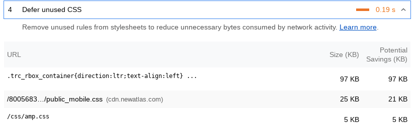

# Introduction

The duplicate CSS remover is part of the 📐 Style.Tools browser widget (see [introduction](../README.md)).

The duplicate CSS remover is a [PostCSS](https://github.com/postcss/postcss) (CSS parser) based solution that enables to remove CSS code from a stylesheet that is present in one or more other stylesheets. 

An example usage case would be to create a `global.css` file that is loaded on all pages with additional files that contain the CSS code specific to a page, e.g. `product.css` for product pages. 

To create `product.css` without CSS code already present in `global.css`, you may start with `total.css` (all CSS of a design), use the [unused CSS remover](unused-css-remover/README.md) to reduce it to the CSS essential for the product page and then remove the CSS code that is already present in `global.css` using the duplicate CSS remover. 

The result is a `product.css` file that can be loaded together with `global.css` for a complete coverage of product pages with the absolute minimum CSS required.

The duplicate CSS remover enables to resolve the Google Lighthouse `Defer unused CSS` pentalty on the basis of pure minimum CSS.

> **Note:** The [async CSS loader](async/README.md) enables to resolve the performance penalty for larger (non-optimized) stylesheets. For example, it could resolve the penalty while using `total.css` by using an efficient load strategy and optimal Critical CSS.

For best performance, reducing the CSS for any page to the minimum required provides the best result. 📐 Style.Tools makes it possible.

## CMS connectors / plugins

You can conditionally load stylesheets using one of the [CMS Connectors](https://github.com/style-tools). It enables to specifically define what stylesheets to load, and how to load them, for any given page or area on a website.

The following example shows a custom PHP CMS that uses a PHP method to determine that a page is a product page, for which then a unique Async Loading configuration is applied. (the same for loading Critical CSS).

