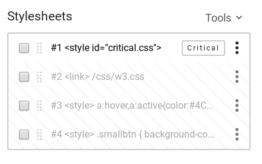
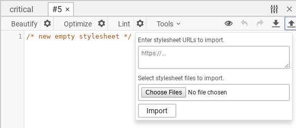
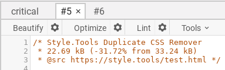

# Usage

The duplicate CSS remover provides many options for tuning the duplicate CSS remover and PostCSS parser. The configuration of the duplicate CSS remover is available in a JSON schema.

https://style.tools/json-schemas/duplicate-css-remover.json

## Configuration

By default, the duplicate CSS remover simply removes duplicate code found in an other stylesheet. The configuration enables to fine tune the PostCSS parser and what selectors and properties to preserve or forcefully remove.

```json
{
  "atRulesToKeep": [],
  "atRulesToRemove": [],
  "selectorsToKeep": [],
  "selectorsToRemove": [],
  "propertiesToKeep": [],
  "propertiesToRemove": [],
  "strictParser": false
}
```

The second input field accepts the stylesheet index number. You can find the index of a stylesheet on the stylesheet overview on the settings tab.



If you want to upload stylesheet or compare stylesheets from external URL(s), you can simply create a new stylesheet and import URLs or upload the stylesheets and use the index from the new sheet in the duplicate CSS remover. It takes just a few clicks. 



Once configured, simply press the button to start the duplicate CSS remover. A CSS comment will display basic statistics of the resulting reduced CSS.



