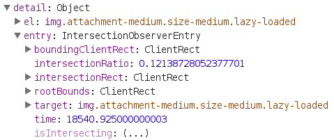

# Introduction

[@style.tools/lazy](https://npmjs.com/package/@style.tools/lazy) is a lightweight lazy loader based on [Intersection Observer V2](https://developers.google.com/web/updates/2019/02/intersectionobserver-v2) with tiny fallback for old browsers.

```javascript
$lazy(
   selector,
   callback /* optional: a custom in-view callback */
);	
```

## Config

The `selector` entry accepts multiple configuration formats including a string, an Array, a Node, NodeList or a JSON object with `observer` configuration.

#### Simple config

```json
{
	"selector": '[data-src]',
	"threshold": 0.006,
	"rootMargin": "0px"
}
```

#### Custom observer config

```json
{
	"selector": '[data-src]',
	"observer": {
		"threshold": 0.006,
		"rootMargin": "0px",
		"trackVisibility": true,
		"delay": 100
	}
}
```

The array based index config is a compressed format to save size in the HTML document. 

[0] = selector
[1] = threshold OR observer config when an object
[2] = rootMargin

#### Simple config

```json
["selector", 0.006, "0px"]
```

#### Custom observer config

```json
["selector", {
	"threshold": 0.006,
	"rootMargin": "0px",
	"trackVisibility": true,
	"delay": 100
}]
```

## Event

When an element enters the viewport the event `$lazy` is fired on the element. The event contains a reference to the HTML node and `IntersectionObserverEntry`.

```javascript
// listen for $lazy event on any element
$(document)[0].addEventListener('$lazy', console.log);

// selectively listen for $lazy event on images using jQuery
jQuery('img').on('$lazy', console.log);
```

The event data is available via `event.detail`.



## Custom callback

When using a custom callback the `$lazy` script essentially functions as a simple in-view solution that can be used for many purposes.

```javascript
$lazy('div#id', function(entries) {
	// entries is a Array of `IntersectionObserverEntry` or HTML Nodes
	// you need to manually verify if the browser supports Intersection Observer

	if (window.IntersectionObserver) {
		// entries[0] = IntersectionObserverEntry
		// entries[0].target = element
	} else {
		// entries[0] = element
	}
})
```

## `data-lazy` JSON config

To enable usage of page based lazy loading config in combination with a strict `Content-Security-Policy` the script can be configured using a `data-lazy` attribute on the script source element.


```html
<script data-lazy="{
   &quot;selector&quot;: &quot;[data-src*='cdn.domain.com']&quot;, 
   &quot;observer&quot;: { 
      &quot;threshold&quot;: [1.0],
      &quot;trackVisibility&quot;: true,
      &quot;delay&quot;: 100
   }
}">
// dist/lazy-data-attr.js (source)
</script>
```

Multiple configurations are supported via the special multi-token `||`. The token needs to be included at the begining and each configuration needs to be valid JSON.

`||{config...}||{second config...}`