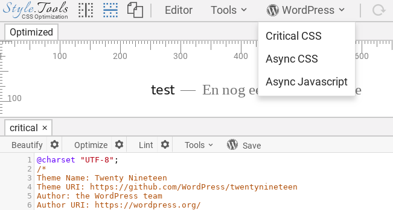

# Introduction

The [📐 Style.Tools](https://style.tools/) PHP library enables to add a professional CSS optimization solution to PHP based content management systems (CMS). The library enables to connect the 📐 Style.Tools browser widget to the CMS and provides access to innovative CSS optimization and management tools.

Some of the features:

- Condtional Critical CSS inlining
- Conditional Async CSS loading
- Conditional Javascript loading
- Real time CSS editor with over 100 themes

## 📐 Style.Tools browser widget

When loading the 📐 Style.Tools browser widget on a PHP based website with the library installed, extra management features become available. Of course only for authenticated administrators.

For an example CMS integration, see the [WordPress plugin](../wordpress/README.md).

