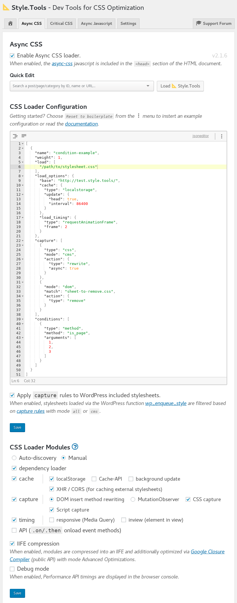

# Introduction

## This plugin is in development. Check back later for <code>v2.0.0</code>

The [📐 Style.Tools](https://style.tools/) plugin for WordPress enables to add a professional CSS optimization solution to WordPress. The plugin connects the browser widget to WordPress and provides access to innovative CSS optimization and management tools.

Some of the features:

- Condtional Critical CSS inlining
- Conditional Async CSS loading
- Conditional Javascript loading
- Real time CSS editor with over 100 themes

## 📐 Style.Tools browser widget

When loading the 📐 Style.Tools browser widget on a WordPress website with the plugin installed, extra management features become available. Of course only for logged in administrators.

## Admin-panel

