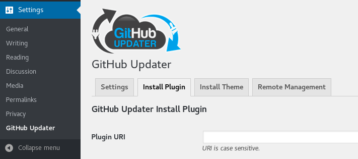
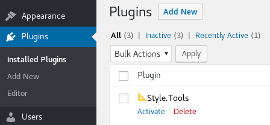

# Installation

## This plugin is in development. Check back later for <code>v2.0.0</code>

You can manually download the zip-file from Github, clone the repository or install the plugin via PHP Composer. 

For automated updates it is possible to install the plugin via [Github Updater](https://github.com/afragen/github-updater).

## Install via PHP Composer

```bash
composer require styletools/wordpress
```

## Install via Github Updater


The plugin can be installed and updated using [Github Updater](https://github.com/afragen/github-updater)

Github Updater is a WordPress plugin that makes it possible to update a Github plugin from the WordPress admin panel as if it is a regular plugin.

### Step 1: Install Github Updater

You can install the Github Updater plugin using the following zip-file:

http://github.com/afragen/github-updater/zipball/master/

For the official Github Updater installation instructions, see https://github.com/afragen/github-updater/wiki/Installation

### Step 2: Install 📐 Style.Tools via Github Updater

The next step is to install the 📐 Style.Tools plugin via Github Updater. You can find the link to Github Updater in the Settings menu. 



Enter the following URL into the `Plugin URI` field and click on the button `Install Plugin`.

https://github.com/style-tools/style-tools-wordpress

The plugin will now be installed.

### Step 3 Activate plugin

Navigate back to the plugin admin page and activate the 📐 Style.Tools plugin.


